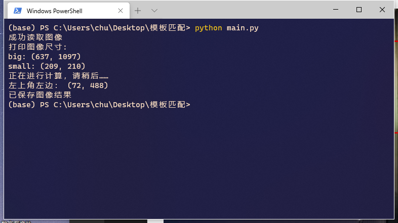
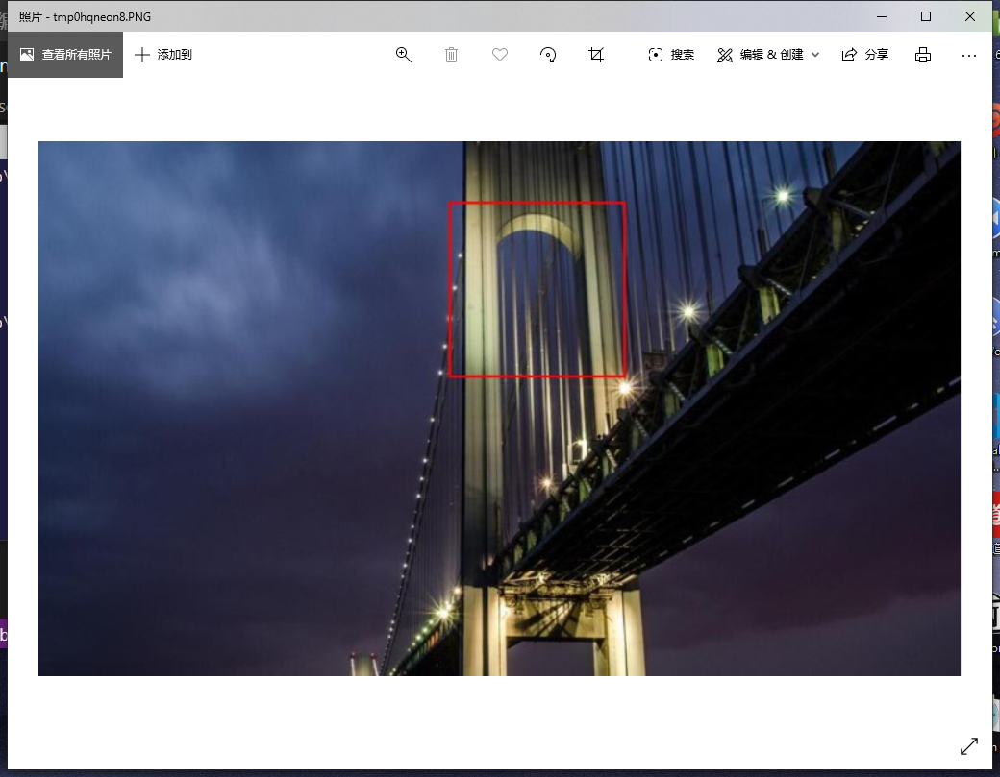
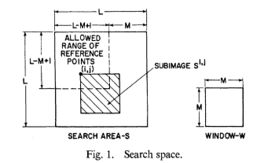
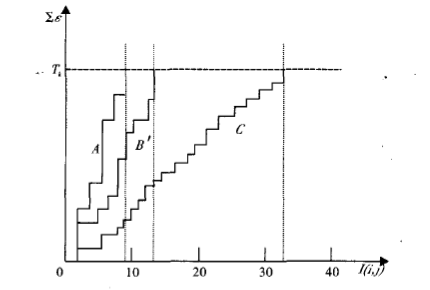

# 模板匹配之SSDA算法

# 配置环境

在`cmd/shell`中运行如下指令：

```
pip install -r requirements.txt
```

# 执行脚本

在img中放入需要匹配的大图和小图，名字必须为`big.jpg`和`small.jpg`

在`cmd/shell`中运行如下指令：

```powershell
# 切换到当前目录下,命令
# cd C:\Users\chu\Desktop\模板匹配
python main.py
```

得到如下运行结果：



并且会弹出已经保存好的图片：



图片保存在当前目录下，即`output.jpg`

# SSDA算法的原理

设**大图**的尺寸为`(MxN)`，**小图**尺寸为`(mxn)`。

在大图中选取`((M-m+1)x(N-n+1))`个框作为**先验框**，也就是说每一个先验框都表示以`(i,j)`为左上定点，宽高均与小图一致的一个框框。



（上图是论文中的原图，尺寸不一样，仅作示意）

## 算法具体描述：

循环遍历所有先验框

* 在小图中找一个随机点，在先验框中相对位置对应一个点。两个点计算误差，`误差=先验框中的对应点灰度值 - 先验框所有点的平均值 - 小图对应点的灰度值 + 小图所有点的平均值`
* 当误差小于上限时，继续找其他随机点，累加误差，直到累加的误差超过上限。记录此时先验框需要的随机点个数

所有先验框中需要**随机点个数最多**的先验框即为最匹配的框。

## 原理

* 如果先验框和小图不相似，那么对应点的误差很大，很少次数的随机点的误差相加，就能超过门限值。

* 如果先验框和小图相似，那么每次找的对应随机点的误差值会非常小，需要迭代累加很多次才能达到门限




# 探讨误差门限的选取依据

误差门限体现在源代码`main.py`中的第40行代码中：

即下面的数字150

```python
# 当误差超过一定的限度，记录下使用的随机点个数
if loss >= 150: 
  R[i,j] = n
```

可以修改数字，选定合适的误差门限。

大体上范围应该在【50~500】之间：

* 门限数字越小，每个先验框平均检测的随机点越少，速度越快，精度越差，太小可能会判错。

* 门限数字越大，每个先验框测试的随机点越多，速度越慢，但是精度越高，极端情况，随机点采遍所有先验框中的点，成了完全遍历

  

> 理论上是超过阈值就停止，但是如果小图是大图的一部分，那么有可能存在所有对应点误差为0的先验框，在该先验框里，无论迭代多少次，误差都达不到上限，会成为死循环。为了避免这种情况，采用的方法是：预先存了50个随机点，只会迭代这些随机点，如果超过次数还未超过阈值，直接进行下一个框的判断，那么`R[i,j] = 50`，即每个框的计数上限是50。

